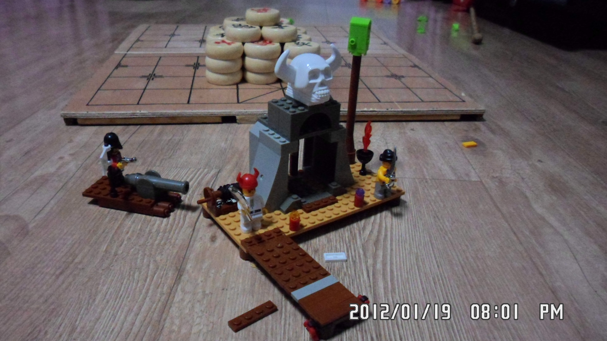

## 基本情况
油海东，男，1979.05，博士，副教授，硕士生导师

## 教育背景
1. 1997年，同济大学
2. 2002年，同济大学
3. 2011年，北京交通大学

## 专业领域
* ROF
* UWB
* Embed system
* 
 插入图片:
 

```c
unsigned long ntp_get_time()
{
  pCon = (struct espconn *)os_zalloc(sizeof(struct espconn));
  pCon->type = ESPCONN_UDP;
  pCon->state = ESPCONN_NONE;
  pCon->proto.udp = (esp_udp *)os_zalloc(sizeof(esp_udp));
  pCon->proto.udp->local_port = espconn_port();
  pCon->proto.udp->remote_port = 123;
  ntp_send_request();
})
```

```matlab
%==========================================================================
%Name:      spectrum_analysis.m
%Desc:      以高斯信号为例，求解其频谱、双边功率谱、单边功率谱、双边功率谱密度、
%           单边功率谱密度，这里高斯信号的半波全宽FWHM=50ps，中心点位于2.5ns处。
%Parameter: 
%Return:    
%Author:    yoyoba(stuyou@126.com)
%Date:      2015-4-28
%Modify:    2015-4-29
%=========================================================================
clc;
clear;
FWHM=50e-12;            %高斯信号FWHM宽度，为50ps
time_window=100*FWHM;   %高斯信号的采样窗口宽度，该值决定了傅里叶变换后的频率分辨率
Ns=2048;                %采样点
dt=time_window/(Ns-1);  %采样时间间隔
t=0:dt:time_window;     %采样时间
gauss_time=exp(-0.5*(2*sqrt(2*log(2))*(t-2.5e-9)/FWHM).^2); %高斯脉冲，中心位于2.5ns处。
plot(t*1e+9,gauss_time,'linewidth',2.5);
xlabel('Time/ns');
ylabel('Amplitude/V');
title('Gauss pulse');
```

```arm
.text
.global _start
_start:
    ldr r0,=0x56000050    @GPFCON地址为0x56000050
    mov r1,#0x00005500    
    str r1,[r0]            @GPFCON写入0x00005500，即GFP4-7设置为输出功能
    
loop:    
    ldr r0,=0x56000054 @GPFDAT地址为0x56000054
    mov r1,#0x000000f0
    str r1,[r0]            @GPFDAT写入0x000000f0，即GPFDAT[7:4]=1111,4个LED灯全灭
    
```