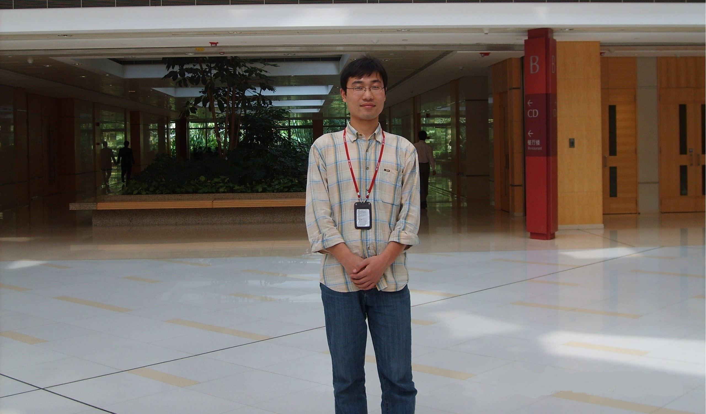

## 【个人经历】
油海东，男，1979年生，博士，副教授，硕士研究生导师，青岛农业大学理学与信息学院通信教研室教师。主讲光纤通信技术、嵌入式系统设计与开发课程。《Chinese Optics Letter》、《光学学报》、《中国激光》、《激光与光电子学进展》、《Optics Express》、《Optics Letter》等审稿人。
website: www.youhaidong.cn
github: https://github.com/stuyou
 
## 【教育经历】
 1997-2001，同济大学，通信工程，获工学学士学位；
 2002-2005，同济大学，通信与信息系统，获工学硕士学位；
 2011-2014，北京交通大学，通信与信息系统，获工学博士学位
 
## 【工作经历】：
2001-2002，大唐电信上海研发中心硬件部；
2005-今，青岛农业大学。
 
## 【主要研究方向】：
光载无线（RoF，Radio over Fiber）通信；
光时域微分器（OTD，Optical Temporal Differentiator）；
超宽带（UWB，Ultra-WideBand）信号光学发生。